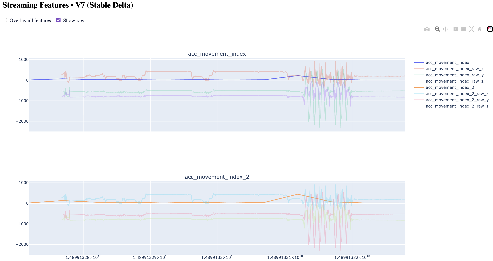

# 💤 Sleep Feature Extractor — MVP Wearable Sleep Analysis

**Status:** Proof of Concept / MVP  
**Tech Stack:** Python, NumPy, Pandas, Dash, Polar SDK, Bleak  

---

## 💡 Problem

Most wearable sleep trackers can only reliably detect whether a user is asleep or awake.  
They struggle to differentiate sleep stages (light, deep, REM) and provide metrics comparable to **polysomnography**, the gold standard in sleep analysis.

This project explores methods to **approximate high-fidelity sleep metrics** using consumer-grade sensors, aiming to:

- provide actionable insights for sleep hygiene and habit optimization  
- build a modular pipeline for feature extraction from multiple wearable streams  

Target users: anyone interested in improving sleep patterns using detailed digital metrics.

---

## 🎯 Goal (MVP & Vision)

**MVP Objective:**

- Implement a proof-of-concept pipeline capable of collecting and processing multiple wearable sensor streams  
- Generate initial features and visualize them in an interactive dashboard  
- Validate feasibility of combining low-level signals (ACC, heart rate, etc.) to approximate sleep stage information  

**Future Vision:**

- Integrate higher-fidelity EEG devices (e.g., Athena S Muse) for closer-to-gold-standard metrics  
- Extend pipelines to multi-device fusion (e.g., Polar Verity Sense + EEG)  
- Build feature stores for long-term sleep tracking and trend analysis  
- Add analytics for community or research use, potentially including advanced sleep scoring algorithms  

---

## 🏗 Architecture

- **Monolithic modular design**  
  - Input modules for multiple sensor streams  
  - In-memory buffering with auto-clearing for long-duration data  
  - Feature parsers and extractors (currently ACC-based)  
  - Flattened, preprocessed data outputs in JSONL (debug) and MessagePack (compact)  
- **Dashboard:** Plotly + Dash interactive visualization for raw and processed data streams  
- **Testing:** Unit tests covering pipeline and feature extraction logic for stable development  

**Patterns used:** Factory / Abstract Factory for modular feature extraction  

---

## ⚙️ Technology Stack

- **Backend:** Python 3.11+  
- **Libraries:**  
  - Data & math: `numpy`, `pandas`  
  - BLE / device SDKs: `bleak`, `polar-python`  
  - Visualization: `plotly`, `dash`  
  - Dev tools: `black`, `pytest`, `rich`, `msgpack`  
- **Data Storage:** JSONL for debugging, MessagePack for efficient storage  

---

## 🧩 Features (Implemented)

- Collect and normalize up to 6 sensor streams simultaneously  
- Feature extraction pipeline for ACC (accelerometer) signals  
- In-memory caching with auto-clear for long-running sessions  
- Interactive dashboard for real-time inspection of raw and processed signals  
- Modular design for easy extension to new sensors or features  
- Full unit test coverage for core pipelines  

### 📸 Example Dashboard

---

## 🎥 Demo / Video
[Watch demo on YouTube]((https://youtu.be/RSyAEPWQ0lA?si=bjZjN-6iIzO0cIEn))

---

## 🚀 Next Steps / Roadmap

- Implement multi-device fusion and EEG integration  
- Extend feature extraction to advanced sleep metrics (REM, deep sleep stages)  
- Build persistent feature store for long-term analysis  
- Add automated reporting and potential ML-driven sleep scoring  
- Explore integration with user apps for personalized sleep insights  

---

## 📌 Why this is relevant for HR / Recruiters

- Shows **initiative in building proof-of-concept MVP**  
- Highlights **modular software design and testing discipline**  
- Demonstrates **product thinking in wearable device analytics**  
- Provides a concrete example of **data-driven feature engineering and visualization pipelines**